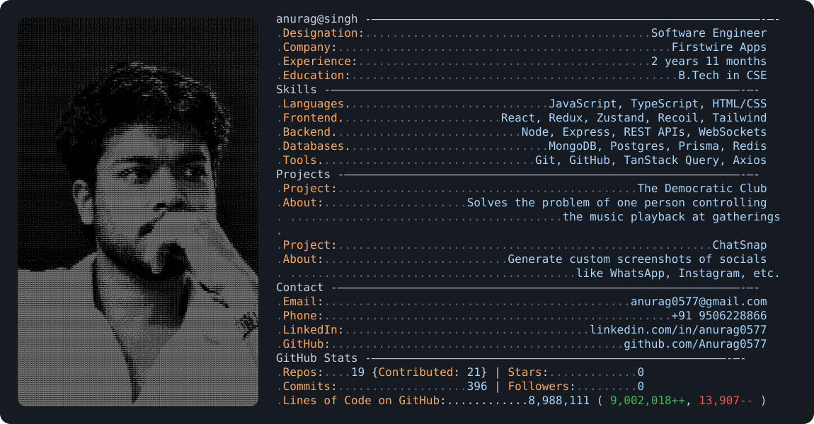

# 🚀 GitHub Profile Stats Generator — Complete Beginner's Setup Guide

An exhaustive, step-by-step tutorial on how to set up, automate, and customize your own live-updating GitHub profile stats card (supporting both Dark & Light modes).

---

## 📑 Table of Contents
1. [How It Works](#-how-it-works)
2. [🔒 Security Notice First](#-security-notice-first)
3. [Step 1: Create Your Profile Repository](#step-1-create-your-profile-repository)
4. [Step 2: Copy the Source Files](#step-2-copy-the-source-files)
5. [Step 3: Generate a Personal Access Token (PAT)](#step-3-generate-a-personal-access-token-pat)
6. [Step 4: Save the Token in GitHub Secrets](#step-4-save-the-token-in-github-secrets)
7. [Step 5: Enable GitHub Actions Workflow Permissions](#step-5-enable-github-actions-workflow-permissions)
8. [Step 6: Personalize Your Information (Avatar, Bio, Skills, Projects, Birthday)](#step-6-personalize-your-information)
   - [6.1 Update Workflow Configuration (`.github/workflows/build.yaml`)](#61-update-workflow-configuration-githubworkflowsbuildyaml)
   - [6.2 Update Birthday / Age Counter (`today.py`)](#62-update-birthday--age-counter-todaypy)
   - [6.3 Update Personal Info in SVGs (`dark_mode.svg` & `light_mode.svg`)](#63-update-personal-info-in-svgs-dark_modesvg--light_modesvg)
     - [A. Profile Avatar Image (Base64)](#a-profile-avatar-image-base64)
     - [B. Header, Designation, Company, Experience, & Education](#b-header-designation-company-experience--education)
     - [C. Tech Stack & Skills](#c-tech-stack--skills)
     - [D. Featured Projects](#d-featured-projects)
     - [E. Contact & Social Links](#e-contact--social-links)
     - [F. Dynamic Stats Placeholders (DO NOT DELETE IDs)](#f-dynamic-stats-placeholders-do-not-delete-ids)
9. [Step 7: Push & Trigger Your First Run](#step-7-push--trigger-your-first-run)
10. [Step 8: Display on Your Public Profile](#step-8-display-on-your-public-profile)
11. [🛠️ Troubleshooting & Common Errors](#️-troubleshooting--common-errors)

---

## ⚙️ How It Works

1. **GitHub Profile Repository**: GitHub has a special feature where a repository named identically to your username (e.g. `octocat/octocat`) renders its root `README.md` at the very top of your public profile page.
2. **SVG Cards**: The profile card is rendered as a clean, vector terminal-styled SVG card (`dark_mode.svg` and `light_mode.svg`).
3. **Automated Cron Workflow**: A GitHub Actions workflow (`.github/workflows/build.yaml`) runs automatically once every day (and whenever you push).
4. **Python Stats Calculation**: The workflow runs `today.py`, which queries the **GitHub GraphQL API v4** using your secure Personal Access Token to count your total commits, repositories, stars, followers, and lines of code (LOC), then automatically updates the numbers in your SVG cards and commits the changes back to your repository.

---

## 🔒 Security Notice First
> ⚠️ **NEVER commit your token or `.env` file to Git!**  
> Tokens must be stored **ONLY** in GitHub Repository Secrets (`Settings → Secrets and variables → Actions`).

---

## Step 1: Create Your Profile Repository

1. Log into your GitHub account and go to [github.com/new](https://github.com/new).
2. Under **Repository name**, enter your **exact GitHub username** (e.g., if your username is `octocat`, type `octocat`).
   - You will see a banner: *"✨ You found a secret! `<username>/<username>` is a special repository that you can use to add a README.md to your GitHub profile."*
3. Set visibility to **Public** (must be Public for others to see your profile card).
4. Check **Add a README file**.
5. Click **Create repository**.

---

## Step 2: Copy the Source Files

Clone your new profile repository to your computer or copy the following files and folders into it:

```text
├── .github/
│   └── workflows/
│       └── build.yaml        # Automated daily GitHub Action workflow
├── cache/
│   └── requirements.txt      # Python dependencies (requests, lxml, pytz)
├── dark_mode.svg             # Dark theme card template
├── light_mode.svg            # Light theme card template
├── today.py                  # Python calculation & stats fetcher script
├── README.md                 # Profile README rendered on GitHub
├── SETUP_GUIDE.md            # This setup manual
└── .gitignore                # Prevents local .env or cache files from leaking
```

---

## Step 3: Generate a Personal Access Token (PAT)

`today.py` needs a Personal Access Token to query your account statistics via the GitHub GraphQL API.

1. Go to [GitHub Settings → Personal Access Tokens (Fine-grained)](https://github.com/settings/tokens?type=beta).
2. Click **Generate new token**.
3. Fill out the token settings:
   - **Token name**: `github-stats-token`
   - **Expiration**: Select `90 days`, `1 year`, or `Custom`. *(Note: When it expires, you can simply generate a new one and update the secret in GitHub).*
   - **Repository access**: Select **All repositories** *(Required so the script can aggregate stars, commits, and lines of code across all your projects).*
4. Under **Permissions**, grant the following **Read-only** scopes:
   - **Account permissions**:
     - `Followers`: **Read-only**
     - `Starring`: **Read-only**
   - **Repository permissions**:
     - `Commit statuses`: **Read-only**
     - `Contents`: **Read-only**
     - `Metadata`: **Read-only**
5. Scroll to the bottom and click **Generate token**.
6. **Copy the token string** (starts with `github_pat_...`). *Keep this tab open or save it somewhere temporarily — you won't be able to view it again on GitHub.*

---

## Step 4: Save the Token in GitHub Secrets

1. Open your profile repository in your browser (`https://github.com/<YOUR_USERNAME>/<YOUR_USERNAME>`).
2. Click **Settings** (top menu bar) → **Secrets and variables** (left sidebar) → **Actions**.
3. Click the green **New repository secret** button.
4. Set:
   - **Name**: `ACCESS_TOKEN` *(⚠️ MUST be spelled exactly like this in ALL CAPS)*
   - **Secret**: Paste the token string copied from Step 3.
5. Click **Add secret**.

---

## Step 5: Enable GitHub Actions Workflow Permissions

To allow the automated GitHub Action to commit and push updated stats back into your repository:

1. In your repository on GitHub, go to **Settings** → **Actions** → **General**.
2. Scroll down to the **Workflow permissions** section.
3. Select **Read and write permissions**.
4. Check the box **Allow GitHub Actions to create and approve pull requests**.
5. Click **Save**.

---

## Step 6: Personalize Your Information

Now, customize all details so the profile card shows **your** name, avatar, job, skills, projects, contact links, and birthday.

---

### 6.1 Update Workflow Configuration (`.github/workflows/build.yaml`)

Open `.github/workflows/build.yaml` in any code editor (like VS Code):

1. **Change `USER_NAME` on line 36**:
   ```yaml
   env:
     ACCESS_TOKEN: ${{ secrets.ACCESS_TOKEN }}
     USER_NAME: YOUR_GITHUB_USERNAME    # <-- Replace with your GitHub username
   ```
2. **Change git author config on lines 40–41** (Optional):
   ```yaml
   git config --global user.email "your-email@example.com"
   git config --global user.name "YOUR_GITHUB_USERNAME"
   ```

---

### 6.2 Update Birthday / Age Counter (`today.py`)

If you want the card to calculate and show your exact real-time age:

Open `today.py` and scroll to **line 451**:
```python
# Replace (YYYY, M, D) with your Year, Month, and Day of birth
age_data, age_time = perf_counter(daily_readme, datetime.datetime(2002, 7, 5))
```
*For example, if you were born on March 15, 2000, set: `datetime.datetime(2000, 3, 15)`.*

---

### 6.3 Update Personal Info in SVGs (`dark_mode.svg` & `light_mode.svg`)

Both `dark_mode.svg` and `light_mode.svg` have the exact same structure. **Make the same edits in both files** so your details stay consistent in dark and light themes!

Open `dark_mode.svg` and `light_mode.svg`:

#### A. Profile Avatar Image (Base64)
- **Line 26**:
  ```xml
  <image x="25" y="25" width="340" height="550" preserveAspectRatio="xMidYMid slice" clip-path="url(#avatarClip)" href="data:image/png;base64,iVBORw0KGgoAAAANSUhEUgAA..."/>
  ```
  **How to add your own photo**:
  1. Pick any photo/avatar (ideally portrait orientation with aspect ratio around 3:5).
  2. Convert your image to a Base64 string using an online converter (e.g., [base64-image.de](https://www.base64-image.de/) or running `base64 -w 0 your_photo.png` in Linux/macOS terminal).
  3. Replace the text inside `href="data:image/png;base64,<PASTE_BASE64_STRING_HERE>"`.

---

#### B. Header, Designation, Company, Experience, & Education
- **Line 29** (Header / Terminal prompt):
  ```xml
  <tspan x="390" y="32">yourname@handle</tspan>
  ```
- **Line 30** (Designation):
  ```xml
  <tspan class="key">Designation</tspan>:<tspan class="cc"> .......................................... </tspan><tspan class="value">Full Stack Developer</tspan>
  ```
- **Line 31** (Company / University / Self-employed):
  ```xml
  <tspan class="key">Company</tspan>:<tspan class="cc"> ................................................. </tspan><tspan class="value">Your Company / University</tspan>
  ```
- **Line 32** (Experience):
  ```xml
  <tspan class="key">Experience</tspan>:<tspan class="cc"> ........................................... </tspan><tspan class="value">3 years 2 months</tspan>
  ```
- **Line 33** (Education):
  ```xml
  <tspan class="key">Education</tspan>:<tspan class="cc"> ................................................ </tspan><tspan class="value">B.S. in Computer Science</tspan>
  ```
*(💡 **Tip**: Adjust the number of dots `....` in `<tspan class="cc">` if you want the right column values to line up neatly).*

---

#### C. Tech Stack & Skills
- **Lines 36–40**:
  ```xml
  <tspan class="key">Languages</tspan>.<tspan class="cc"> ............................. </tspan><tspan class="value">Python, JavaScript, Go, C++</tspan> 
  <tspan class="key">Frontend</tspan>.<tspan class="cc"> ....................... </tspan><tspan class="value">React, Next.js, Vue, TailwindCSS</tspan> 
  <tspan class="key">Backend</tspan>.<tspan class="cc"> ........................... </tspan><tspan class="value">FastAPI, Node.js, Django, Docker</tspan> 
  <tspan class="key">Databases</tspan>.<tspan class="cc"> ............................. </tspan><tspan class="value">PostgreSQL, Redis, MongoDB</tspan> 
  <tspan class="key">Tools</tspan>.<tspan class="cc"> ............................... </tspan><tspan class="value">Git, Linux, AWS, Kubernetes</tspan>
  ```

---

#### D. Featured Projects
- **Lines 43–49**:
  ```xml
  <tspan class="key">Project</tspan>:<tspan class="cc"> ............................................ </tspan><tspan class="value">My Awesome App</tspan> 
  <tspan class="key">About</tspan>:<tspan class="cc"> ..................... </tspan><tspan class="value">A high-performance real-time chat application</tspan> 
  <tspan class="cc">. ........................................ </tspan><tspan class="value">built with WebSockets and Go.</tspan> 
  
  <tspan class="key">Project</tspan>:<tspan class="cc"> ....................................................... </tspan><tspan class="value">DevToolkit</tspan> 
  <tspan class="key">About</tspan>:<tspan class="cc"> ........................... </tspan><tspan class="value">CLI utility for automating cloud</tspan> 
  <tspan class="cc">. .......................................... </tspan><tspan class="value">infrastructure deployments.</tspan>
  ```

---

#### E. Contact & Social Links
- **Lines 52–55**:
  ```xml
  <tspan class="key">Email</tspan>:<tspan class="cc"> ............................................. </tspan><tspan class="value">youremail@example.com</tspan> 
  <tspan class="key">Phone</tspan>:<tspan class="cc"> ................................................... </tspan><tspan class="value">+1 234 567 8900</tspan> 
  <tspan class="key">LinkedIn</tspan>:<tspan class="cc"> .................................... </tspan><tspan class="value">linkedin.com/in/yourhandle</tspan> 
  <tspan class="key">GitHub</tspan>:<tspan class="cc"> ........................................... </tspan><tspan class="value">github.com/YOUR_USERNAME</tspan>
  ```

---

#### F. Dynamic Stats Placeholders (DO NOT DELETE IDs)
- **Lines 58–60**:
  ```xml
  <tspan class="key">Repos</tspan>:<tspan class="cc" id="repo_data_dots"> .... </tspan><tspan class="value" id="repo_data">0</tspan> {<tspan class="key">Contributed</tspan>: <tspan class="value" id="contrib_data">0</tspan>} | <tspan class="key">Stars</tspan>:<tspan class="cc" id="star_data_dots"> ............. </tspan><tspan class="value" id="star_data">0</tspan>
  <tspan class="key">Commits</tspan>:<tspan class="cc" id="commit_data_dots"> ................... </tspan><tspan class="value" id="commit_data">0</tspan> | <tspan class="key">Followers</tspan>:<tspan class="cc" id="follower_data_dots"> ......... </tspan><tspan class="value" id="follower_data">0</tspan>
  <tspan class="key">Lines of Code on GitHub</tspan>:............<tspan class="cc" id="loc_data_dots"></tspan><tspan class="value" id="loc_data">0</tspan> ( <tspan class="addColor" id="loc_add">0</tspan><tspan class="addColor">++</tspan>, <tspan id="loc_del_dots"> </tspan><tspan class="delColor" id="loc_del">0</tspan><tspan class="delColor">--</tspan> )
  ```
  ⚠️ **Important**: `today.py` locates elements by their `id` attribute (`repo_data`, `star_data`, `commit_data`, `follower_data`, `loc_data`, `loc_add`, `loc_del`, etc.). **Do not remove or rename these IDs!**

---

## Step 7: Push & Trigger Your First Run

1. Commit and push all your personalized changes:
   ```bash
   git add .
   git commit -m "Configure personal GitHub profile stats"
   git push origin main
   ```
2. Go to your repository on GitHub.
3. Click the **Actions** tab at the top.
4. Select **README build** in the left sidebar.
5. Click the **Run workflow** dropdown on the right → Click the green **Run workflow** button.
6. Refresh the page after 1–2 minutes. You will see a green checkmark `README build #1`!
7. Check `dark_mode.svg` and `light_mode.svg` — all your live GitHub contributions, commits, lines of code, and stars are now automatically populated!

---

## Step 8: Display on Your Public Profile

Add this snippet to your root `README.md`:

```markdown
# Hi there 👋

<div align="center">
  <picture>
    <source media="(prefers-color-scheme: dark)" srcset="dark_mode.svg">
    <source media="(prefers-color-scheme: light)" srcset="light_mode.svg">
    
  </picture>
</div>
```

*GitHub will now automatically display `dark_mode.svg` for dark mode users and `light_mode.svg` for light mode users on your public profile!*

---

## 🛠️ Troubleshooting & Common Errors

| Error | Cause | Solution |
| :--- | :--- | :--- |
| **`401 Client Error: Bad credentials`** | `ACCESS_TOKEN` is missing, expired, or invalid. | Verify that secret name is exact (`ACCESS_TOKEN`) under **Settings → Secrets and variables → Actions** and re-paste your valid token from Step 3. |
| **`actions/cache: v2 deprecated`** | Workflow is using outdated GitHub Actions versions. | Ensure `.github/workflows/build.yaml` uses `actions/checkout@v4`, `actions/setup-python@v5`, and `actions/cache@v4`. |
| **`Permission to <repo> denied to github-actions[bot]` (403)** | Workflow lacks write permissions to commit changes. | Go to **Settings → Actions → General → Workflow permissions** and select **Read and write permissions** (Step 5). |
| **Stars count showing 0** | Fine-grained PAT does not have access to all repos. | When generating the token (Step 3), ensure **Repository access** is set to **All repositories**. |
| **Age not matching your birthday** | `today.py` birthday parameter is set to default. | Open `today.py` line 451 and update `datetime.datetime(YYYY, M, D)` with your birth year, month, and day. |

---

🎉 **You're all done!** Your GitHub profile stats card will now automatically update every night at midnight UTC!
